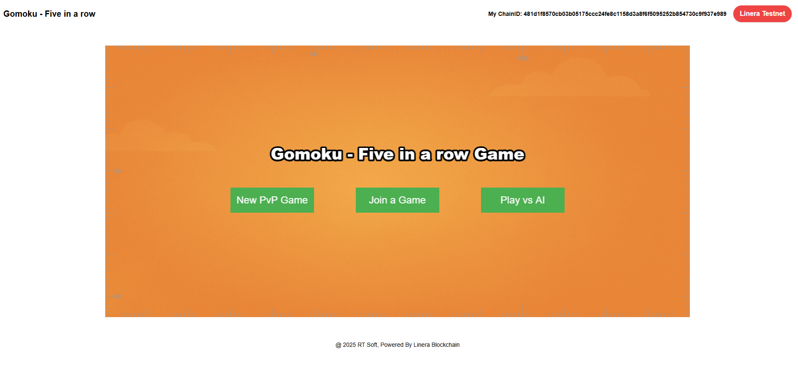
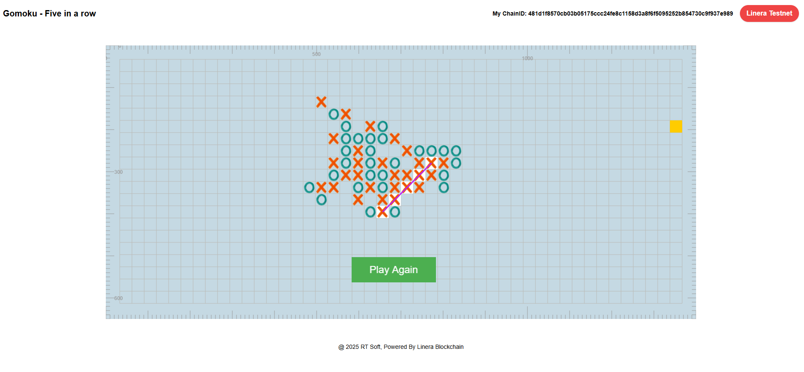

# Gomoku-Linera-Microchain 🎮⚡

**Gomoku (Five in a Row)** – a real-time, online multiplayer board game built on the **Linea Blockchain**, leveraging **Linera Microchain cross-message communication**.

Players can create or join games seamlessly, with moves synchronized across chains using smart contracts deployed on Linera’s Microchain framework.

---

### 🔗 Live Demo  
**👉** https://gomoku-psi.vercel.app

---

## 🚀 Features

This project is built using HTML and pure JavaScript for logic, with **Phaser 3** as the game UI engine.

- ✅ Online Gomoku gameplay powered by Linera Blockchain Testnet  
- ✅ Real-time cross-chain messaging via Microchains  
- ✅ Supports both PvP (human vs human) and AI gameplay  
- ✅ Lightweight frontend running directly in the browser  
- ✅ Clean and easy-to-understand codebase  
- ✅ Smooth 2D game experience powered by Phaser 3  

---

## 📘 Learn About Linera Microchain Architecture

By exploring this project, you'll gain hands-on experience with:

- Creating and deploying Microchain smart contracts using **Rust**
- Sending and receiving messages across Microchains  
- Frontend-to-chain interaction through Linera SDK  
- Handling smart contract state updates via notifications  
- Applying Microchains to a real-time turn-based game architecture  

---

## 📦 Requirements

- **Rust** & **Cargo**  
- **Linera CLI**  
- **Python 3**  
- OS: Windows or Linux

---

## 🛠️ Getting Started

### 🔧 Backend – Smart Contract (Linera SDK)

1. **Configure your deployment wallet**

You need a wallet address to deploy the application:

- To use the **Linera Babbage Testnet**:
  ```bash
  FAUCET_URL=https://faucet.testnet-babbage.linera.net
  ```

- Or to use a **local testnet**:
  ```bash
  FAUCET_URL=http://localhost:8080
  export RUST_LOG="warn,linera_execution::wasm=trace"
  linera net up --with-faucet --faucet-port 8080
  ```

- (Optional) Remove old wallet configuration:
  ```bash
  rm -rf ~/.config/linera/*
  ```

- Create a new wallet and chain:
  ```bash
  linera wallet init --with-new-chain --faucet $FAUCET_URL
  ```

2. **Build the WebAssembly contracts:**
   ```bash
   cargo build --release --target wasm32-unknown-unknown
   ```

3. **Publish and deploy to the network:**
   ```bash
   linera publish-and-create target/wasm32-unknown-unknown/release/gomoku_{contract,service}.wasm
   ```
   You will receive an **Application ID** upon successful deployment.

---

### 🌐 Frontend – Game Client

1. **Run the local server**
   On Windows:
   ```bash
   ./frontend/runLocalServer.bat
   ```

2. **Open the game in your browser**
   ```
   http://localhost:8000/
   ```

---

## ⚙️ Frontend Configuration

Update your deployed **Application ID** in the following file:

```
./frontend/main.js
```

Locate the line that sets `APP_ID = ...` and replace it with the Application ID received after deployment.

---

## 🖼️ Screenshots

  


---

## 🤝 Contributing

Contributions are welcome!  
Feel free to submit pull requests or open issues.

This project demonstrates how **Microchains** can be applied to decentralized real-time applications like board games, leveraging Linera’s scalable infrastructure on the **Linea ecosystem**.

---
